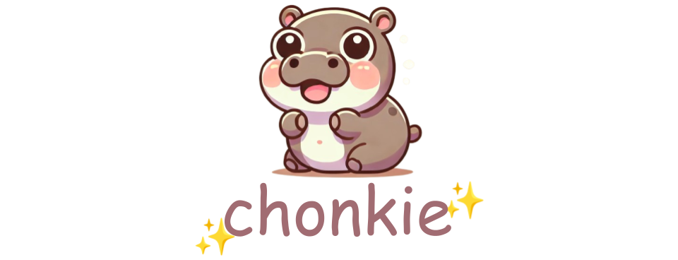

# Welcome to Chonkie-inc! 👋

At Chonkie-inc, we're focused on building developer tools for the modern AI stack that are **simple to use** and **performant where it matters**.

Our journey started with tackling the text chunking problem, leading to the creation of our flagship library:

- **[Chonkie](https://github.com/chonkie-inc/chonkie)**: The no-nonsense, ultra-light, and lightning-fast chunking library. 🦛✨

Beyond chunking, we're actively exploring and working on other critical areas within the AI ecosystem, including:

- Retrieval-Augmented Generation (RAG)
- Embeddings and Embedding Models
- Tokenizers

We believe in creating tools that "just work" and streamline the development process for AI practitioners.

---

**Meet the Team:**

At our core, Chonkie-inc is currently a passionate two-person startup:

- [Bhavnick Minhas](https://github.com/chonknick)
- [Shreyash Nigam](https://github.com/shreyash-chonkie)

We're excited about the future of AI development and are committed to contributing efficient and effective tools to the community!
