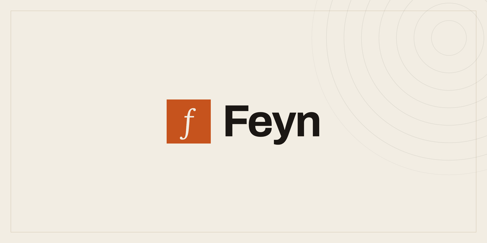

  <picture>
    <source media="(prefers-color-scheme: dark)" srcset="./assets/feyn-banner-dark.png">
    
  </picture>
  <h2 align="center">Feyn</h2>
  

    Developer tools for the modern AI stack — simple to use, performant where it matters.
     
     
    <a href="https://discord.gg/vH3SkRqmUz">Discord</a>
    ·
    <a href="https://chonkie.ai">Website</a>
    ·
    <a href="https://github.com/feyninc/chonkie/issues">Issues</a>
  

## What we build

- **[Chonkie](https://github.com/feyninc/chonkie)** ([py](https://pypi.org/project/chonkie/), [js](https://www.npmjs.com/package/chonkie), [rs](https://crates.io/crates/chonkie)) — The no-nonsense, ultra-light, and lightning-fast chunking library. 🦛✨
- **[Pulpie](https://github.com/feyninc/pulpie)** — Pareto-optimal models for cleaning the web — SOTA extraction quality at one twentieth the cost. 🍊✨
- **[Catsu](https://github.com/feyninc/catsu)** — One embedding client and database for all your embedding needs! 🐱🍛
- **[Memchunk](https://github.com/feyninc/memchunk)** — Blazingly fast text chunker to chunk text at up to 1TB/s 🚀
- **[Mandex](https://github.com/feyninc/mandex)** — Blazingly fast documentation access for AI agents — local-first, version-matched, and free forever. 📑🤖
